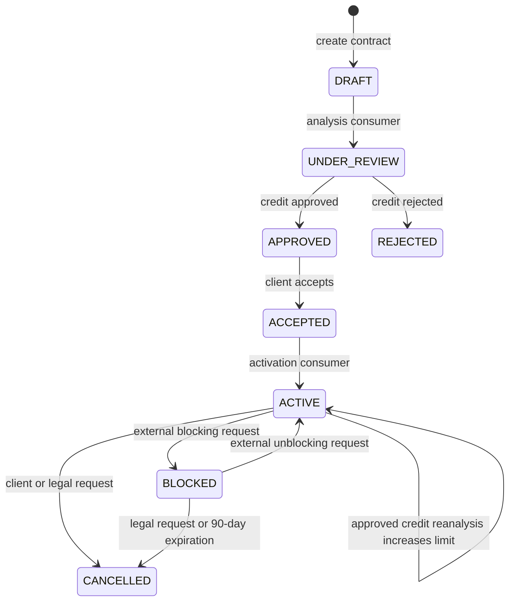
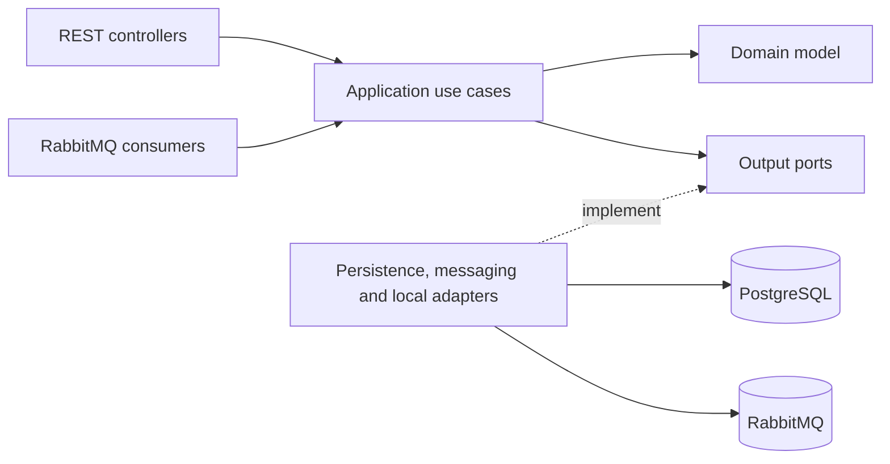

# Credit Contract Manager

Backend for the lifecycle of Brazilian personal credit contracts, built as a
portfolio and learning project with Java 21, Spring Boot, PostgreSQL, RabbitMQ,
and production-oriented reliability patterns.


> [!IMPORTANT]
> This project demonstrates architecture and business lifecycle design. It is
> not production-ready yet: authentication, authorization, legal acceptance
> evidence, and a broader LGPD review remain outside the current scope.

## Contents

- [About the project](#about-the-project)
- [Contract lifecycle](#contract-lifecycle)
- [Architecture](#architecture)
- [Technology stack](#technology-stack)
- [Getting started](#getting-started)
- [API walkthrough](#api-walkthrough)
- [Events and reliability](#events-and-reliability)
- [Observability](#observability)
- [Tests](#tests)
- [Project structure](#project-structure)
- [Roadmap and documentation](#roadmap-and-documentation)

## About the project

Credit Contract Manager is a modular backend that owns contract state and its
business invariants. It is intentionally more than CRUD: creating a contract
starts an asynchronous credit analysis; approval, client acceptance,
activation, blocking, unblocking, and cancellation are distinct business facts
with an auditable status history.

The current implementation includes:

- CPF validation and an immutable client-data snapshot;
- restart-safe contract numbers generated by a PostgreSQL sequence;
- asynchronous approval or rejection through RabbitMQ;
- explicit client acceptance followed by internal asynchronous activation;
- synchronous blocking requests restricted to active contracts;
- synchronous unblocking requests restricted to blocked contracts;
- manual cancellation with different client and legal rules;
- automatic cancellation after a configurable 90-day blocked period;
- asynchronous credit reanalysis for active contracts with a configurable
  30-day cooldown and durable request audit;
- deterministic reanalysis outcomes with explicit previous and resulting limits;
- transactional outbox and inbox-based idempotency;
- bounded retries, dead-letter queues, correlation IDs, metrics, and logs;
- deterministic local fakes and PostgreSQL/RabbitMQ integration tests.

Authentication is not implemented yet.

## Contract lifecycle



Every transition is validated by the `CreditContract` aggregate and appended
to `contract_status_history`. Transition-specific reasons, such as rejection or
blocking or unblocking, belong to the history entry rather than nullable
columns on the contract.

Credit reanalysis is audited separately because it changes the approved limit,
not the lifecycle status; the contract remains `ACTIVE` while it is assessed.

## Architecture

The code follows DDD-inspired Clean Architecture boundaries. Dependencies point
inward, and the domain has no Spring, JPA, HTTP, database, or messaging
dependency.



The main architectural choices are:

- domain entities and JPA entities are separate and explicitly mapped;
- Flyway is the only schema evolution mechanism;
- aggregate changes and outbound events commit atomically in PostgreSQL;
- consumers assume at-least-once delivery and apply idempotent effects;
- the application remains a modular monolith while using asynchronous
  boundaries where they represent real business flow.

See the [architecture overview](docs/architecture/overview.md) for the data
model, message flow, and operational details.

## Technology stack

| Area | Technology |
| --- | --- |
| Language and framework | Java 21, Spring Boot 3.5.3 |
| API | Spring MVC, Jakarta Validation, Springdoc OpenAPI |
| Persistence | PostgreSQL 17, Spring Data JPA, Hibernate, Flyway |
| Messaging | RabbitMQ 4, Spring AMQP, transactional outbox and inbox |
| Observability | Actuator, Micrometer, Prometheus, Grafana, Loki, Alloy |
| Testing | JUnit 5, Spring Boot Test, Testcontainers |
| Local environment | Docker, Docker Compose, Maven Wrapper |

## Getting started

### Prerequisites

- Docker Engine with Docker Compose;
- Git.

Java 21 is only required when running the Maven commands directly on the host.

### Start the complete local environment

```bash
git clone https://github.com/tmcly/credit-contract-manager.git
cd credit-contract-manager
docker compose up --build
```

Flyway applies the database migrations at startup and Hibernate validates the
resulting schema. Wait until the application health check reports `UP`:

```bash
curl http://localhost:8080/health
# {"status":"UP"}
```

The environment exposes:

| Service | URL | Local credentials |
| --- | --- | --- |
| API | <http://localhost:8080> | none |
| Swagger UI | <http://localhost:8080/swagger-ui/index.html> | none |
| RabbitMQ Management | <http://localhost:15672> | `credit_contract` / `credit_contract` |
| Prometheus | <http://localhost:9090> | none |
| Grafana | <http://localhost:3000> | `admin` / `admin` |
| Alloy UI | <http://localhost:12345> | none |

The credentials above are development defaults only. Stop the environment with
`docker compose down`; add `-v` only when you also want to delete local data.

## API walkthrough

All business endpoints accept an optional UUID `X-Correlation-ID` header and
return the effective value in the response. The examples use a valid CPF that
the deterministic local analysis stub approves.

### 1. Create a contract

```bash
curl -i -X POST http://localhost:8080/api/contracts \
  -H "Content-Type: application/json" \
  -d '{"documentNumber":"529.982.247-25"}'
```

The API returns `201 Created`, a `Location` header, and a contract initially in
`DRAFT`. Creation does not wait for credit analysis.

```json
{
  "id": "4c9a18f2-72ef-4b80-b676-8a1679b60da0",
  "contractNumber": "CT-2026-000001",
  "clientName": "Daniel Caldas",
  "status": "DRAFT",
  "creditLimit": null,
  "createdAt": "2026-07-12T15:30:00",
  "version": 0
}
```

Contract numbers are unique across restarts and concurrent requests. Sequence
gaps are expected when a transaction rolls back after reserving a number.

### 2. Follow the asynchronous analysis

```bash
curl http://localhost:8080/api/contracts/{id}
```

The state progresses through `UNDER_REVIEW` and ends in either `APPROVED` with
a positive `creditLimit` or `REJECTED` without one. For local demonstrations,
valid CPFs ending in `0` or `1` are rejected; endings from `2` through `9` are
approved deterministically.

### 3. Accept the approved offer

```bash
curl -X POST http://localhost:8080/api/contracts/{id}/acceptance
```

Only an `APPROVED` contract can be accepted. The response can briefly show
`ACCEPTED`; an internal RabbitMQ consumer then moves it to `ACTIVE` and emits a
separate activation event.

### 4. Block an active contract

```bash
curl -X POST http://localhost:8080/api/contracts/{id}/blocking \
  -H "Content-Type: application/json" \
  -d '{"reason":"Payment overdue for more than 30 days"}'
```

Only `ACTIVE` contracts can transition to `BLOCKED`. The reason is required,
limited to 255 characters, and stored on the status-history transition.
Repeating an already completed block is state-idempotent and does not create a
second history entry or event.

### 5. Unblock a blocked contract

```bash
curl -X POST http://localhost:8080/api/contracts/{id}/unblocking \
  -H "Content-Type: application/json" \
  -d '{"reason":"Outstanding balance settled"}'
```

Only `BLOCKED` contracts can transition back to `ACTIVE`. The reason is
required, limited to 255 characters, and stored on the status-history
transition. Requests for contracts in any other state return a transition
conflict and do not emit an event.

### 6. Cancel a contract manually

```bash
curl -X POST http://localhost:8080/api/contracts/{id}/cancellation \
  -H "Content-Type: application/json" \
  -d '{"requestedBy":"CLIENT","reason":"Cancellation requested by the client"}'
```

`CLIENT` requests are accepted only for `ACTIVE` contracts. `LEGAL` requests
can cancel either `ACTIVE` or `BLOCKED` contracts. Cancellation ends future
credit availability but does not represent debt payment or forgiveness.

Blocked contracts are also cancelled automatically when they remain blocked
for 90 days. The duration is the configurable business policy
`credit-contract.cancellation.blocked-expiration`; it is not presented as a
universal statutory deadline.

### 7. Request credit reanalysis

```bash
curl -i -X POST http://localhost:8080/api/contracts/{id}/credit-reanalysis
```

Only an `ACTIVE` contract accepts reanalysis. The API returns `202 Accepted`
because the provider runs asynchronously, and the contract remains active with
its current limit during processing.

```json
{
  "requestId": "c9574f50-72f5-4a08-9efd-44ad0f708ea8",
  "contractId": "4c9a18f2-72ef-4b80-b676-8a1679b60da0",
  "status": "REQUESTED",
  "requestedAt": "2026-07-12T15:30:00",
  "nextEligibleAt": "2026-08-11T15:30:00"
}
```

Every accepted request starts the configurable 30-day cooldown, including an
eventually rejected assessment. Requests inside the interval return `429 Too
Many Requests` with `nextEligibleAt`.

The local deterministic provider rejects valid CPFs ending in `0` or `1`.
Endings `2-4`, `5-7`, and `8-9` multiply the current limit by `1.5`, `2`, and
`3`, respectively, capped at R$ 100,000. These bands are demonstration policy.

### Endpoint summary

| Method | Path | Purpose |
| --- | --- | --- |
| `POST` | `/api/contracts` | Create a contract and request analysis asynchronously |
| `GET` | `/api/contracts/{id}` | Read the current eventually consistent state |
| `POST` | `/api/contracts/{id}/acceptance` | Accept an approved credit offer |
| `POST` | `/api/contracts/{id}/blocking` | Block an active contract with a reason |
| `POST` | `/api/contracts/{id}/unblocking` | Return a blocked contract to active status |
| `POST` | `/api/contracts/{id}/cancellation` | Cancel by client or legal request |
| `POST` | `/api/contracts/{id}/credit-reanalysis` | Request asynchronous limit reanalysis for an active contract |
| `GET` | `/health` | Lightweight application health check |
| `GET` | `/actuator/health` | Detailed infrastructure health |

The complete interactive API contract is available in Swagger UI after the
application starts.

## Events and reliability

Business events are written to `outbox_events` in the same PostgreSQL
transaction as contract state. A scheduled relay publishes them to the durable
`credit-contract.events` exchange and marks them as published only after a
RabbitMQ publisher confirmation.

| Event | Routing key | Local destination |
| --- | --- | --- |
| `CreditContractCreated` | `credit-contract.created.v1` | `credit-analysis.requests` |
| `CreditAnalysisApproved` | `credit-analysis.approved.v1` | `credit-analysis.results` |
| `CreditAnalysisRejected` | `credit-analysis.rejected.v1` | `credit-analysis.results` |
| `CreditContractAccepted` | `credit-contract.accepted.v1` | `credit-contract.activation.requests.v2` |
| `CreditContractActivated` | `credit-contract.activated.v1` | `credit-contract.activation.results` |
| `CreditContractBlocked` | `credit-contract.blocked.v1` | `credit-contract.lifecycle.events` |
| `CreditContractUnblocked` | `credit-contract.unblocked.v1` | `credit-contract.lifecycle.events` |
| `CreditContractCancelled` | `credit-contract.cancelled.v1` | `credit-contract.lifecycle.events` |
| `CreditReanalysisRequested` | `credit-reanalysis.requested.v1` | `credit-reanalysis.requests` |
| `CreditReanalysisApproved` | `credit-reanalysis.approved.v1` | `credit-reanalysis.results` |
| `CreditReanalysisRejected` | `credit-reanalysis.rejected.v1` | `credit-reanalysis.results` |

Delivery is at least once. Successfully consumed event IDs are stored in the
PostgreSQL inbox in the same transaction as their business effects. Consumer
failures retry with bounded exponential backoff before reaching a dedicated
dead-letter queue; outbox publication failures remain eligible for retry and
eventually require operator intervention after the configured limit.

## Observability

- `/actuator/prometheus` exposes application and messaging metrics;
- the provisioned **Credit Contract Messaging** Grafana dashboard shows queue,
  outbox, retry, and latency signals;
- Alloy collects Compose logs into Loki;
- the provisioned **Credit Contract Logs** dashboard filters structured JSON
  logs by level, event, correlation ID, contract ID, and text.

The logging policy excludes CPF, client snapshots, addresses, broker payloads,
credit limits, analysis reasons, and raw exception messages. A returned
correlation ID can be searched in Grafana Explore with:

```logql
{service_name="credit-contract-manager"} | json | correlationId="<uuid>"
```

## Tests

The test suite includes domain and use-case unit tests, REST tests, PostgreSQL
persistence tests, and RabbitMQ/outbox integration tests. Java 21 and a running
Docker Engine are required because integration tests use Testcontainers.

```bash
./mvnw clean test
```

When Java 21 is not installed locally, run Maven in a container while sharing
the Docker socket with Testcontainers:

```bash
docker run --rm \
  -v "$PWD":/workspace \
  -v /var/run/docker.sock:/var/run/docker.sock \
  -w /workspace \
  maven:3.9-eclipse-temurin-21 \
  mvn -B clean test
```

## Project structure

```text
src/main/java/br/com/creditcontract/
├── domain/                  # Aggregate, events, value objects, invariants
├── application/
│   ├── usecase/             # Synchronous and message-driven orchestration
│   └── port/out/            # Required external capabilities
└── adapter/
    ├── in/
    │   ├── rest/            # Controllers and transport DTOs
    │   └── messaging/       # RabbitMQ consumers
    └── out/
        ├── fake/            # Deterministic local integrations
        ├── messaging/       # RabbitMQ topology and publisher
        └── persistence/     # JPA mapping, PostgreSQL, outbox and inbox
```

## Roadmap and documentation

The repository keeps implementation context close to the code:

- [Architecture overview](docs/architecture/overview.md) explains boundaries,
  persistence, messaging, and observability;
- [Architecture Decision Records](docs/architecture/decisions/README.md) capture
  the rationale and trade-offs behind accepted decisions;
- [Implementation roadmap](docs/roadmap.md) separates completed phases from the
  follow-up backlog;
- [Agent guide](AGENTS.md) defines repository conventions and verification.

The next candidate capabilities are richer read APIs, optimistic-lock conflict
handling, CI, and API security. The roadmap remains the
source of truth for sequencing them.
