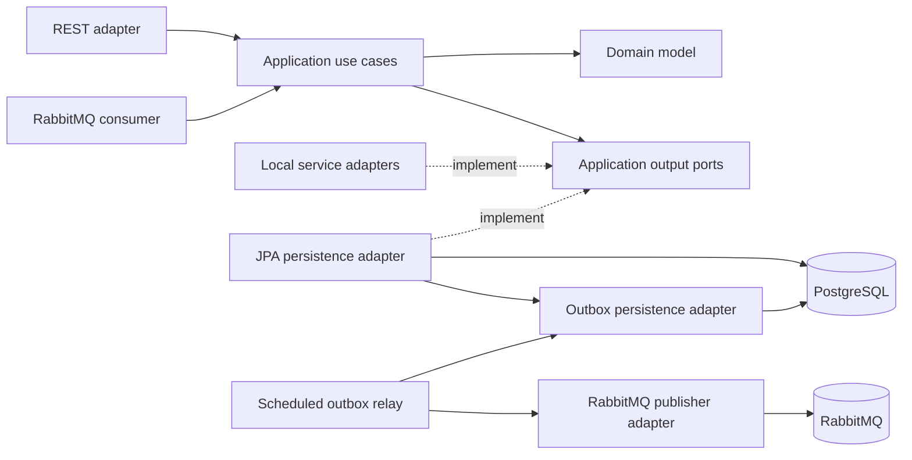
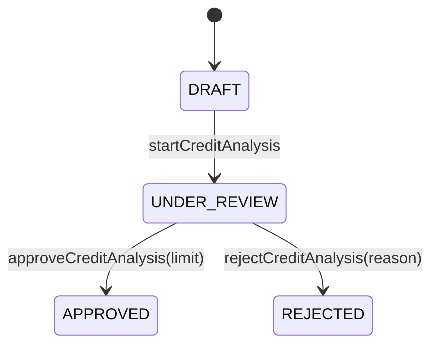
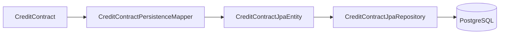
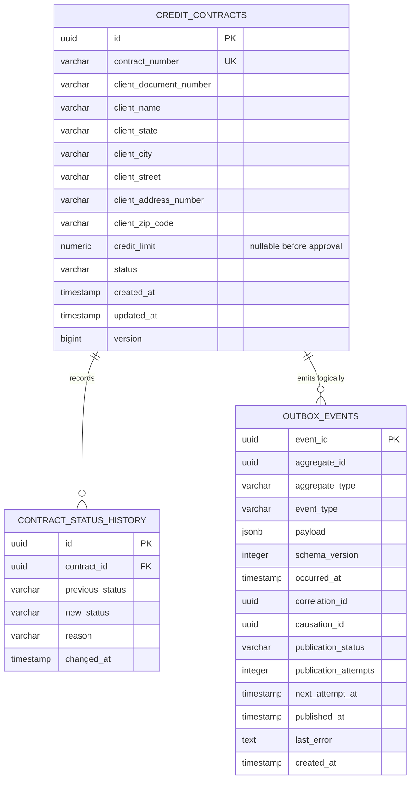
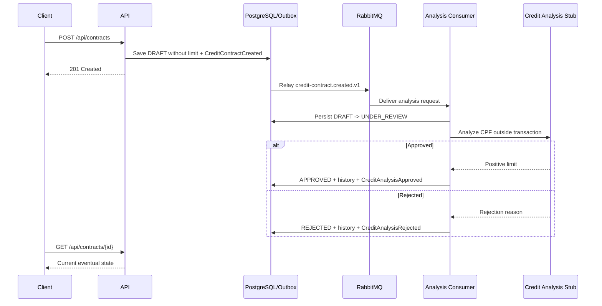
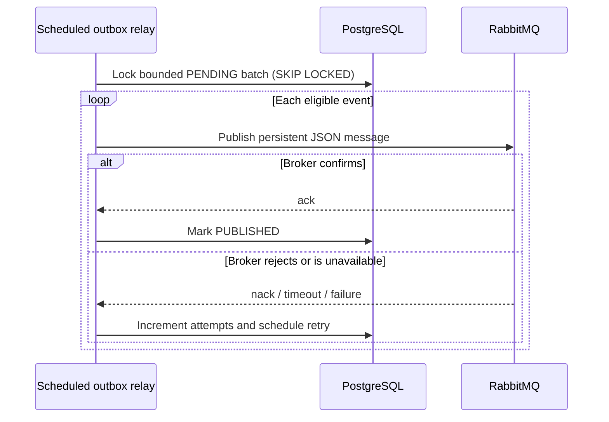

# Architecture Overview

## Purpose

Credit Contract Manager models the lifecycle of Brazilian personal credit
contracts. The codebase is intentionally evolving as a modular backend with
DDD-inspired boundaries, explicit application ports, relational persistence,
and a planned event-driven workflow.

The architecture is designed to make business rules visible while keeping
framework and integration details replaceable.

## Dependency direction



The domain has no dependency on Spring, JPA, HTTP, PostgreSQL, or messaging.
Application use cases orchestrate the domain and depend on output-port
interfaces. Inbound and outbound adapters translate external concerns at the
system boundary.

## Main packages

```text
br.com.creditcontract
├── domain
│   ├── entity
│   ├── event
│   ├── enums
│   ├── exception
│   └── valueobject
├── application
│   ├── exception
│   ├── port/out
│   └── usecase
└── adapter
    ├── in
    │   ├── rest
    │   └── messaging/rabbitmq
    └── out
        ├── fake
        ├── messaging/rabbitmq
        ├── persistence
        │   ├── jpa
        │   ├── outbox
        │   └── postgres
        └── stub
```

## Domain model

`CreditContract` is the aggregate root. It owns its identity, public contract
number, client snapshot, optional approved credit limit, current status, timestamps,
optimistic version, and immutable status-transition history.

The client is not a separate aggregate in this bounded context. Its document,
name, and address are captured as a snapshot supplied by an external client
registry adapter. The contract therefore preserves the information used at the
time of contracting even if the external registry later changes.

`DocumentNumber` is named after the business concept exposed by the application
but accepts CPF only because the product currently supports people, not legal
entities.

Contracts are created as `DRAFT` without a limit. Analysis first moves them to
`UNDER_REVIEW`, then to `APPROVED` with a positive limit or `REJECTED` without a
limit. Every transition is explicit in the aggregate and appended to history.



## Persistence boundary



The domain aggregate and JPA entities are separate models. The mapper prevents
persistence annotations, table layout, cascade behavior, and lazy-loading
concerns from leaking into the domain.

The mapper supports both writes and deliberate JPA-to-domain rehydration,
including status history and optimistic version.

Flyway owns schema evolution. Hibernate is configured to validate rather than
create the schema. PostgreSQL constraints reinforce document shape, supported
statuses, non-negative monetary values, uniqueness, and referential integrity.

## Data model



The status history is the audit trail for lifecycle transitions. The initial
entry is `null -> DRAFT`; later transitions carry one optional business reason.

## Current contract and analysis flow



The consumer uses two database transactions around the analysis provider. This
makes `UNDER_REVIEW` durable before the external work and lets re-delivery resume
after a crash. Terminal `APPROVED` and `REJECTED` contracts ignore duplicate
creation events. Contract numbers still come from a PostgreSQL sequence, while
client-registry and analysis integrations remain deterministic local substitutes.

## Transactional outbox

Contract creation records a versioned `CreditContractCreated` event inside the
aggregate. The persistence adapter stores the contract, its initial status
history, and a JSON representation of that event in `outbox_events` within the
same PostgreSQL transaction. If any write fails, all of them roll back together.

Event JSON serialization and outbox SQL remain outbound concerns, so the domain
does not depend on Jackson, JDBC, JPA, or messaging. Pending aggregate events are
removed from memory only after the transaction commits. Outbox rows start as
`PENDING`.

## RabbitMQ publication



The application declares the durable `credit-contract.events` direct exchange,
the `credit-analysis.requests` and `credit-analysis.results` queues, and their
versioned bindings. Messages preserve event identity,
aggregate metadata, event type, schema version, occurrence time, correlation
ID, and optional causation ID.

The relay selects a bounded batch with `FOR UPDATE SKIP LOCKED`, allowing more
than one application instance without selecting the same row concurrently. A
publisher confirmation is required before the database row becomes
`PUBLISHED`. A crash between broker confirmation and database commit may cause
a duplicate delivery, which is expected under the project's at-least-once
contract and must be handled idempotently by future consumers.

## Target evolution

The event-driven workflow now performs asynchronous credit analysis. The next
evolution hardens retry, dead-letter handling, inbox idempotency, logs, and
metrics while preserving at-least-once delivery.

See [the roadmap](../roadmap.md) for the implementation sequence and
[the ADR index](decisions/README.md) for decision rationale.
