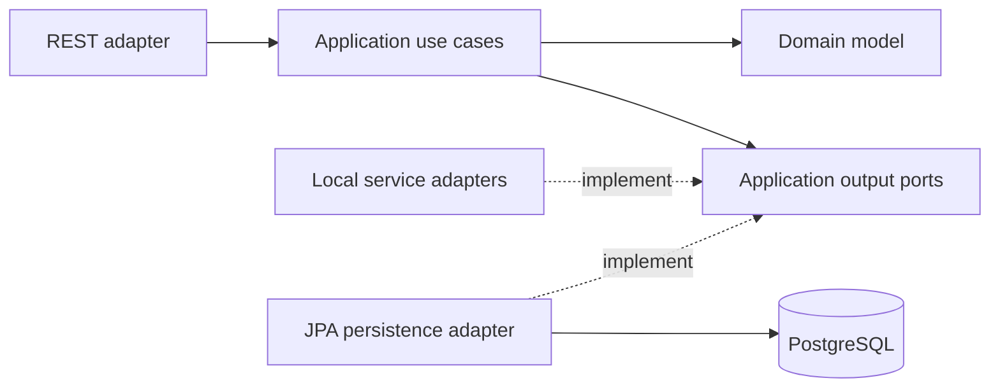
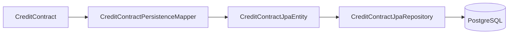
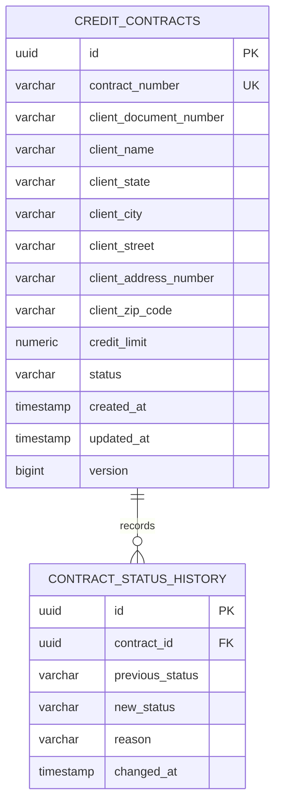
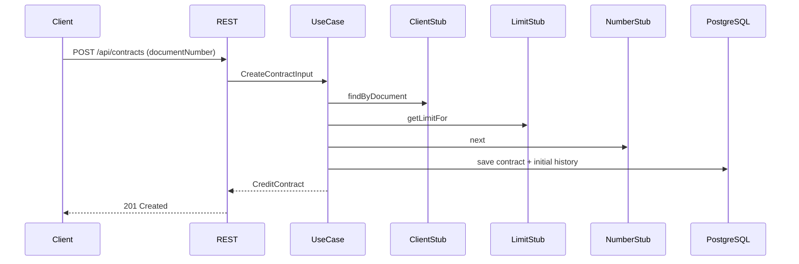

# Architecture Overview

## Purpose

Credit Contract Manager models the lifecycle of Brazilian personal credit
contracts. The codebase is intentionally evolving as a modular backend with
DDD-inspired boundaries, explicit application ports, relational persistence,
and a planned event-driven workflow.

The architecture is designed to make business rules visible while keeping
framework and integration details replaceable.

## Dependency direction



The domain has no dependency on Spring, JPA, HTTP, PostgreSQL, or messaging.
Application use cases orchestrate the domain and depend on output-port
interfaces. Inbound and outbound adapters translate external concerns at the
system boundary.

## Main packages

```text
br.com.creditcontract
├── domain
│   ├── entity
│   ├── enums
│   ├── exception
│   └── valueobject
├── application
│   ├── exception
│   ├── port/out
│   └── usecase
└── adapter
    ├── in/rest
    └── out
        ├── persistence
        │   ├── jpa
        │   └── postgres
        └── stub
```

## Domain model

`CreditContract` is the aggregate root. It owns its identity, public contract
number, client snapshot, approved credit limit, current status, timestamps,
optimistic version, and immutable status-transition history.

The client is not a separate aggregate in this bounded context. Its document,
name, and address are captured as a snapshot supplied by an external client
registry adapter. The contract therefore preserves the information used at the
time of contracting even if the external registry later changes.

`DocumentNumber` is named after the business concept exposed by the application
but accepts CPF only because the product currently supports people, not legal
entities.

## Persistence boundary



The domain aggregate and JPA entities are separate models. The mapper prevents
persistence annotations, table layout, cascade behavior, and lazy-loading
concerns from leaking into the domain.

The current mapper supports the write direction. Read use cases will require a
deliberate JPA-to-domain rehydration path before they are added.

Flyway owns schema evolution. Hibernate is configured to validate rather than
create the schema. PostgreSQL constraints reinforce document shape, supported
statuses, non-negative monetary values, uniqueness, and referential integrity.

## Data model



The status history is the audit trail for lifecycle transitions. The initial
entry is `null -> DRAFT`; later transitions carry one optional business reason.

## Current synchronous flow



The synchronous flow is the current implementation, not the final event-driven
target. Contract numbers come from a PostgreSQL sequence, while client and
credit-limit integrations remain local substitutes. Sequence gaps are valid
after rollbacks because uniqueness is required but gapless numbering is not.
The Flyway upgrade aligns the sequence with numbers previously issued by the
local stub before PostgreSQL becomes the active generator.

## Target evolution

The accepted direction is an event-driven workflow using PostgreSQL,
transactional outbox, and RabbitMQ. The target must preserve consistency across
the database and broker, assume at-least-once delivery, and make consumers
idempotent.

See [the roadmap](../roadmap.md) for the implementation sequence and
[the ADR index](decisions/README.md) for decision rationale.
