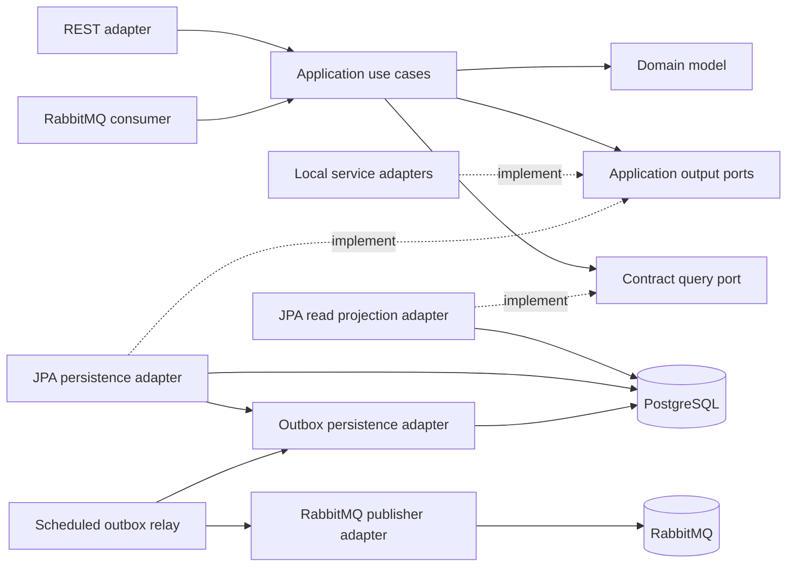
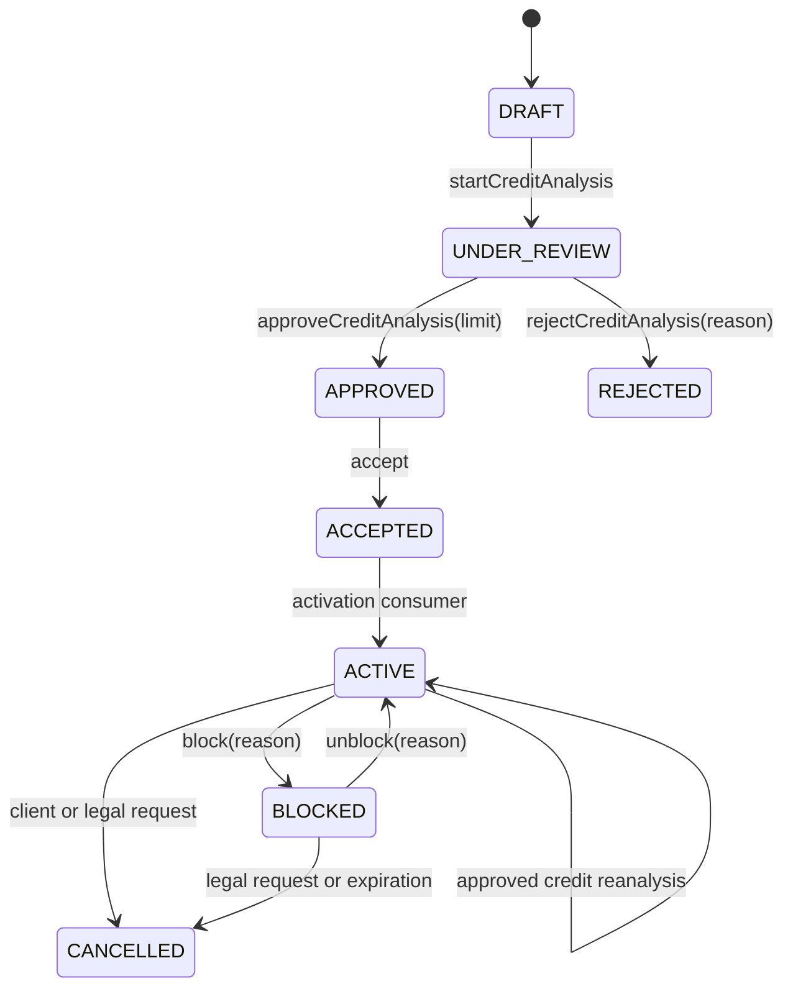
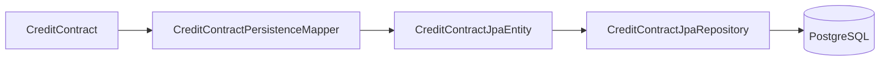
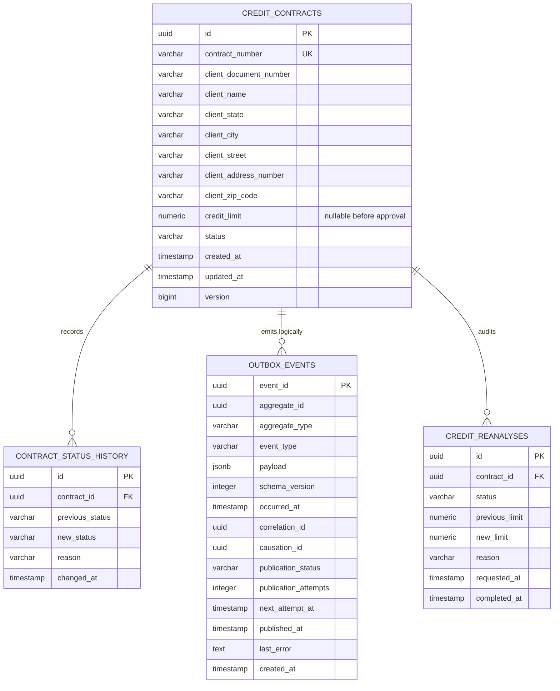
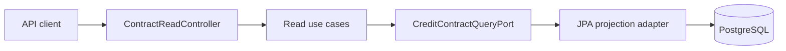
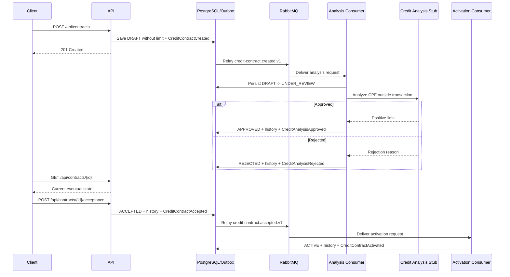
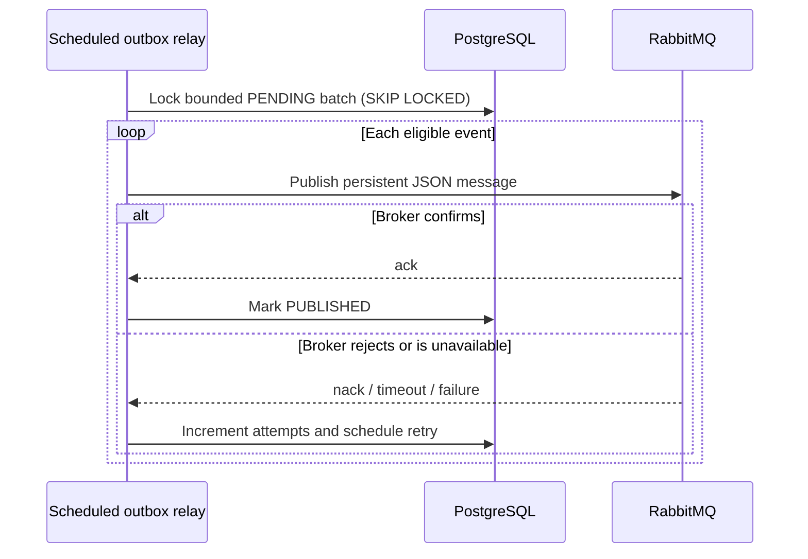
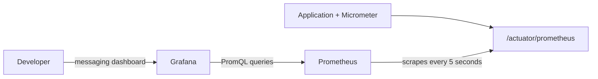
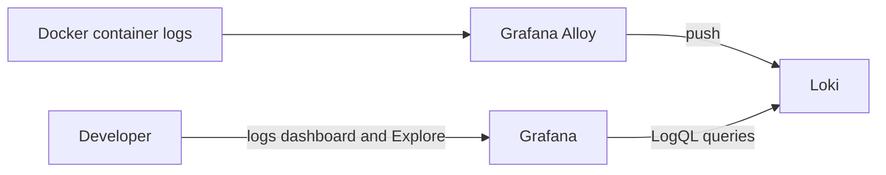

# Architecture Overview

## Purpose

Credit Contract Manager models the lifecycle of Brazilian personal credit
contracts. The codebase is intentionally evolving as a modular backend with
DDD-inspired boundaries, explicit application ports, relational persistence,
and an event-driven workflow.

The architecture is designed to make business rules visible while keeping
framework and integration details replaceable.

## Dependency direction



The domain has no dependency on Spring, JPA, HTTP, PostgreSQL, or messaging.
Application use cases orchestrate the domain and depend on output-port
interfaces. Inbound and outbound adapters translate external concerns at the
system boundary.

The REST adapter also owns the generated OpenAPI 3.1 contract. Controller and
transport annotations describe operations, lifecycle preconditions, parameters,
examples, and HTTP outcomes without leaking documentation concerns into the
application or domain layers. A focused MVC test generates `/v3/api-docs` and
asserts that public paths, examples, and RFC 7807 error schemas remain present.

## Main packages

```text
br.com.creditcontract
├── domain
│   ├── entity
│   ├── event
│   ├── enums
│   ├── exception
│   └── valueobject
├── application
│   ├── exception
│   ├── query
│   ├── port/out
│   └── usecase
└── adapter
    ├── in
    │   ├── rest
    │   └── messaging/rabbitmq
    └── out
        ├── fake
        ├── messaging/rabbitmq
        ├── persistence
        │   ├── jpa
        │   ├── outbox
        │   └── postgres
        └── stub
```

## Domain model

`CreditContract` is the aggregate root. It owns its identity, public contract
number, client snapshot, optional approved credit limit, current status, timestamps,
optimistic version, and immutable status-transition history.

The client is not a separate aggregate in this bounded context. Its document,
name, and address are captured as a snapshot supplied by an external client
registry adapter. The contract therefore preserves the information used at the
time of contracting even if the external registry later changes.

`DocumentNumber` is named after the business concept exposed by the application
but accepts CPF only because the product currently supports people, not legal
entities.

Contracts are created as `DRAFT` without a limit. Analysis first moves them to
`UNDER_REVIEW`, then to `APPROVED` with a positive limit or `REJECTED` without a
limit. Approval does not activate the credit: the client must explicitly accept
the contract before this application's asynchronous activation consumer moves
it to `ACTIVE`. Every transition is explicit in the aggregate and appended to
history.

An active contract can also own multiple `CreditReanalysis` child entities.
Reanalysis does not change contract status: each child records its request and
outcome while an approved result updates the aggregate's current limit.



## Persistence boundary



The domain aggregate and JPA entities are separate models. The mapper prevents
persistence annotations, table layout, cascade behavior, and lazy-loading
concerns from leaking into the domain.

The mapper supports both writes and deliberate JPA-to-domain rehydration,
including status history and optimistic version.

Collection reads use a separate `CreditContractQueryPort`. Its JPA adapter
selects lightweight summary or audit projections and applies filters,
pagination, and stable ordering in PostgreSQL. This avoids rehydrating the
aggregate and its growing child collections merely to render a list. It is a
read-side optimization inside the same application and database, not a
separate CQRS store.

Flyway owns schema evolution. Hibernate is configured to validate rather than
create the schema. PostgreSQL constraints reinforce document shape, supported
statuses, non-negative monetary values, uniqueness, and referential integrity.

## Data model



The status history is the audit trail for lifecycle transitions. The initial
entry is `null -> DRAFT`; later transitions carry one optional business reason.

## Read API flow



`GET /api/contracts` returns a stable API-owned page envelope and supports
exact status, CPF, and contract-number filters. CPF is normalized and used only
as a predicate; it is not returned by the collection endpoint. Sorting is
restricted to indexed `createdAt` or `updatedAt` fields and always adds an ID
tie-breaker. Page size is limited to 100.

`GET /api/contracts/{id}/history` and
`GET /api/contracts/{id}/credit-reanalyses` expose the two audit streams
independently, newest first. They first distinguish a missing contract from an
existing contract with an empty audit collection.

## Current contract and analysis flow



The consumer uses two database transactions around the analysis provider. This
makes `UNDER_REVIEW` durable before the external work and lets re-delivery resume
after a crash. Terminal `APPROVED` and `REJECTED` contracts ignore duplicate
creation events. Contract numbers still come from a PostgreSQL sequence, while
client-registry and analysis integrations remain deterministic local substitutes.

`CreditAnalysisApproved` can notify external channels that an offer is ready.
Client acceptance is a separate synchronous command and emits
`CreditContractAccepted` to the durable `credit-contract.activation.requests.v2`
queue. This application's activation consumer owns `ACCEPTED -> ACTIVE`, stores
the accepted event in the inbox, and emits the separate
`CreditContractActivated` fact atomically through the outbox. Exhausted
activation failures are routed to a dedicated dead-letter queue.
The consumer also drains the legacy unversioned queue so existing local brokers
can migrate without deleting queued acceptance events.

An external application can synchronously request blocking through the REST
adapter. The application use case loads the aggregate, which alone permits
`ACTIVE -> BLOCKED`, records the supplied reason in status history, and emits
`CreditContractBlocked` through the outbox. The fact is routed with
`credit-contract.blocked.v1`; future downstream services can bind their own
queues without changing the blocking rule.

The same synchronous command boundary exposes unblocking. The aggregate alone
permits `BLOCKED -> ACTIVE`, records the supplied reason in status history, and
emits `CreditContractUnblocked` through the transactional outbox. The event is
routed with `credit-contract.unblocked.v1` to the lifecycle-events queue. An
`ACTIVE` contract is not treated as an idempotent unblocking success because it
may never have been blocked; every successful request therefore represents a
real transition from `BLOCKED`.

Manual cancellation enters through REST. Client requests permit only
`ACTIVE -> CANCELLED`, while legal requests permit both `ACTIVE -> CANCELLED`
and `BLOCKED -> CANCELLED`. A scheduled inbound adapter also queries blocked
contracts whose `updatedAt` is at or before the configured cutoff and applies
`BLOCKED -> CANCELLED` in bounded batches. The default cutoff is 90 days after
blocking and remains configuration, not a hard-coded legal claim. Every path
emits `CreditContractCancelled` with its origin through the outbox.

Credit reanalysis enters synchronously through REST only for `ACTIVE` contracts.
The aggregate appends an auditable `REQUESTED` child record and emits
`CreditReanalysisRequested` atomically. A RabbitMQ consumer invokes the
reanalysis provider outside the database transaction, then revalidates the
aggregate and stores `APPROVED` with an increased limit or `REJECTED` with the
retained limit. The contract stays `ACTIVE` throughout. A configurable 30-day
cooldown is calculated from the latest accepted request, and result delivery is
idempotent through the processed-message inbox.

## Transactional outbox

Contract creation records a versioned `CreditContractCreated` event inside the
aggregate. The persistence adapter stores the contract, its initial status
history, and a JSON representation of that event in `outbox_events` within the
same PostgreSQL transaction. If any write fails, all of them roll back together.

Event JSON serialization and outbox SQL remain outbound concerns, so the domain
does not depend on Jackson, JDBC, JPA, or messaging. Pending aggregate events are
removed from memory only after the transaction commits. Outbox rows start as
`PENDING`.

## RabbitMQ publication



The application declares the durable `credit-contract.events` direct exchange,
the `credit-analysis.requests` and `credit-analysis.results` queues, and their
versioned bindings. Messages preserve event identity,
aggregate metadata, event type, schema version, occurrence time, correlation
ID, and optional causation ID.

The relay selects a bounded batch with `FOR UPDATE SKIP LOCKED`, allowing more
than one application instance without selecting the same row concurrently. A
publisher confirmation is required before the database row becomes
`PUBLISHED`. A crash between broker confirmation and database commit may cause
a duplicate delivery, which is expected under the project's at-least-once
contract and must be handled idempotently by future consumers.

## Target evolution

The event-driven workflow performs asynchronous credit analysis with bounded
retry, dead-letter handling, inbox idempotency, correlation metadata, structured
logs, and Micrometer metrics while preserving at-least-once delivery.

See [the roadmap](../roadmap.md) for the implementation sequence and
[the ADR index](decisions/README.md) for decision rationale.

## Local observability



Prometheus retains seven days of local metric history. Grafana's datasources and
dashboards are provisioned from the repository, so rebuilding the environment
does not require clicking through setup screens.



Alloy discovers local containers through the read-only Docker socket and labels
their logs by Compose service. Loki keeps seven days locally, and Grafana offers
structured application filters for level, event, `correlationId`, and
`contractId`. Alloy promotes only bounded `level` and `event` values to Loki
labels; identifiers stay inside each JSON log line to avoid high-cardinality
indexes. CPF, client snapshots, addresses, payloads, credit limits, analysis
reasons, and raw exception messages are excluded by the application logging
policy.
