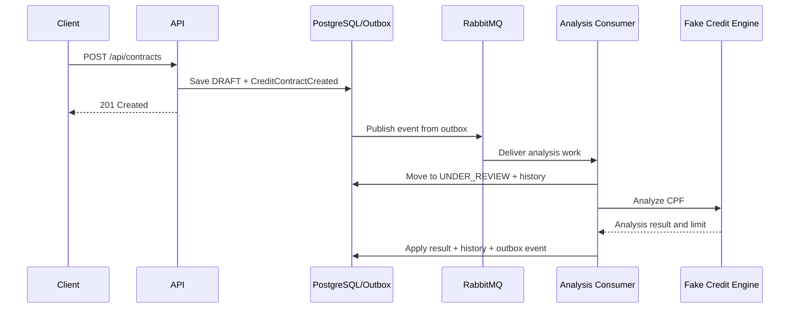

# Implementation Roadmap

This roadmap records the agreed implementation sequence so future tasks can
continue without reconstructing decisions from chat history. Each phase should
be delivered as a separate branch and ready-for-review pull request from an
up-to-date `master`.

The sequence favors working vertical increments over installing infrastructure
without a business flow.

## Current baseline

Already implemented:

- Java 21 and Spring Boot backend;
- CPF-only `DocumentNumber` validation;
- DDD-inspired `CreditContract` aggregate and value objects;
- inbound REST and outbound port/adapter boundaries;
- deterministic credit-analysis stub with approval and rejection;
- PostgreSQL persistence through an isolated JPA adapter;
- Flyway-managed schema;
- client snapshot stored with the contract;
- generic status-transition history;
- restart-safe contract numbers backed by a PostgreSQL sequence;
- deterministic Brazilian client snapshots derived from the input CPF;
- versioned `CreditContractCreated` domain events;
- atomic PostgreSQL transactional outbox persistence;
- confirmed RabbitMQ publication from bounded outbox batches;
- durable contract-event exchange, analysis queue, and binding;
- asynchronous credit analysis with state-aware duplicate handling;
- query endpoint for eventually consistent contract results;
- Docker Compose local environment;
- PostgreSQL integration tests with Testcontainers;
- inbox-based consumer idempotency, bounded retries, DLQ, correlation, and messaging metrics;
- local Prometheus collection and a provisioned Grafana messaging dashboard;
- local Docker log aggregation through Grafana Alloy, Loki, and Grafana.
- correlated structured JSON application logs with safe fields and provisioned
  Grafana filters.
- explicit client acceptance after analysis approval, with a versioned event;
- asynchronous internal contract activation with inbox idempotency, a versioned
  result event, bounded retries, and a dedicated DLQ;
- synchronous blocking of active contracts with a required history reason and
  versioned `CreditContractBlocked` outbox event.
- synchronous unblocking of blocked contracts with a required history reason
  and versioned `CreditContractUnblocked` outbox event.
- requester-aware manual cancellation and automatic cancellation after a
  configurable 90-day blocked period.
- client-requested asynchronous credit reanalysis for active contracts, with a
  configurable 30-day cooldown, deterministic local outcomes, durable audit,
  inbox idempotency, and before/after limit events.
- paginated contract search and independently paginated status and reanalysis
  audit APIs backed by lightweight read projections.

## Phase 1: Generate contract numbers with PostgreSQL ✅

Status: completed.

Suggested branch:

```text
feat/generate-contract-numbers-with-postgres
```

### Goal

Replace the restart-sensitive in-memory `AtomicLong` generator with a
concurrency-safe PostgreSQL sequence while preserving the existing application
port.

### Scope

- Add a Flyway migration for `credit_contract_number_seq`.
- Implement `PostgresContractNumberGenerator` behind
  `ContractNumberGenerator`.
- Format the public identifier as `CT-YYYY-NNNNNN`.
- Keep the unique database constraint on `contract_number`.
- Restrict or remove the runtime stub so Spring has one active implementation.
- Document that sequence gaps are valid after rollbacks or failed requests.
- Add integration coverage proving uniqueness across multiple calls.

### Acceptance criteria

- Application restarts cannot repeat a previously issued number.
- Concurrent generation returns distinct values.
- No `MAX(contract_number) + 1` query is used.
- Unit and PostgreSQL integration tests pass.

## Phase 2: Add a deterministic fake client registry ✅

Status: completed.

Implementation note: Datafaker 2.7.0 was selected instead of a curated local
dataset because its Brazilian locale can generate varied client snapshots while
a CPF-derived seed keeps demonstrations reproducible.

Suggested branch:

```text
refactor/add-deterministic-client-fake
```

### Goal

Return varied, plausible client snapshots during local demonstrations without
introducing flaky or irreproducible behavior.

### Scope

- Rename `StubClientDataProvider` to `FakeClientDataProvider` if it gains
  generation behavior.
- Derive a stable seed from the normalized CPF.
- Generate or select a Brazilian name and valid address from deterministic data.
- Guarantee that the same CPF always returns the same snapshot.
- Keep unit-test fixtures explicit and fixed; do not make unit tests random.
- Evaluate Datafaker versus a small curated local dataset before adding a
  runtime dependency.
- Activate the fake only in an appropriate local profile when a real client
  registry adapter exists.

### Acceptance criteria

- Different CPFs normally produce different snapshots.
- Repeated calls for one CPF produce equal snapshots.
- Generated CEP and address fields satisfy domain validation.
- Tests remain deterministic across machines and runs.

## Phase 3: Add domain events and transactional outbox ✅

Status: completed.

Suggested branch:

```text
feat/add-transactional-outbox
```

### Goal

Persist aggregate changes and the intent to publish their events atomically,
without adding a broker dependency yet.

### Scope

- Define a small domain-event abstraction.
- Introduce `CreditContractCreated` as the first event.
- Let the aggregate record new events without knowing their transport format.
- Add an `outbox_events` Flyway migration with fields for:
  - event ID;
  - aggregate ID and type;
  - event type;
  - JSON payload;
  - schema version;
  - occurrence timestamp;
  - correlation and causation IDs;
  - publication state and attempt metadata.
- Persist the contract and outbox records in one transaction.
- Keep serialization and outbox persistence in adapters.
- Add integration tests for atomic success and rollback.

### Acceptance criteria

- A committed contract always has its expected outbox event.
- A failed transaction leaves neither contract nor event committed.
- Domain code has no RabbitMQ, JSON, or JPA dependency.
- Events use stable names and explicit schema versions.

## Phase 4: Publish outbox events through RabbitMQ ✅

Status: completed.

Suggested branch:

```text
feat/publish-contract-events-with-rabbitmq
```

### Goal

Reliably relay pending outbox events to RabbitMQ and establish the first durable
messaging topology.

### Scope

- Add RabbitMQ and its management UI to Docker Compose.
- Add Spring AMQP in the outbound messaging adapter.
- Declare a durable contract-events exchange, queues, and bindings.
- Implement an outbox publisher with bounded batches.
- Use publisher confirms before marking an outbox record as published.
- Preserve event ID, type, schema version, correlation ID, and causation ID in
  message metadata.
- Add broker integration tests with Testcontainers.
- Add health information for broker connectivity.

### Acceptance criteria

- Pending events are eventually published after temporary broker downtime.
- Confirmed events are not continuously republished.
- Unconfirmed events remain eligible for retry.
- The topology is declared by the application and reproducible locally.

## Phase 5: Make credit analysis asynchronous ✅

Status: completed.

Implementation note: ADR 005 resolves the decision gate. Contracts have no
limit before approval, rejection is an explicit status, and analysis outcomes
use separate `CreditAnalysisApproved` and `CreditAnalysisRejected` events.

Suggested branch:

```text
feat/process-credit-analysis-asynchronously
```

### Goal

Turn the broker infrastructure into a real business workflow instead of a demo
that only logs messages.

### Decision gate

Before coding, finalize the invariant for contracts awaiting analysis. The
current aggregate requires a credit limit during creation; the asynchronous
model likely needs the limit to be absent until analysis completes. Update the
domain and schema deliberately rather than introducing `null` accidentally.

### Target flow



### Scope

- Add explicit aggregate methods for legal lifecycle transitions.
- Add JPA-to-domain mapping and repository lookup needed by consumers.
- Move credit-limit resolution out of the HTTP creation transaction.
- Consume a contract-created or analysis-requested message.
- Transition through `UNDER_REVIEW` and record history.
- Apply the credit-engine result and publish either `CreditAnalysisApproved` or
  `CreditAnalysisRejected`.
- Add the explicit `REJECTED` status.
- Expose a query endpoint so clients can observe eventual completion.

### Acceptance criteria

- The HTTP request no longer waits for credit analysis.
- Every status change is validated by the aggregate and recorded in history.
- Reprocessing the same event does not repeat the business transition.
- Clients can query the current state after receiving `201 Created`.

## Phase 6: Add messaging resilience and observability ✅

Status: completed.

Implementation note: ADR 006 records the inbox transaction boundary, bounded
consumer and outbox retries, durable dead-letter topology, correlation contract,
Micrometer instrumentation, and the manual replay procedure.

Suggested branch:

```text
feat/harden-event-processing
```

### Goal

Make at-least-once messaging behavior explicit, recoverable, and observable.

### Scope

- Add retry with exponential backoff and a bounded attempt count.
- Configure a dead-letter exchange and queue.
- Add an inbox/processed-message store keyed by event ID.
- Make consumers idempotent within the same transaction as their state change.
- Propagate correlation and causation IDs through logs and events.
- Add structured logs for publication, consumption, retry, and dead-lettering.
- Add Micrometer metrics for pending outbox records, publish latency, consumer
  success/failure, retries, and DLQ depth where available.
- Define an operational replay procedure for dead-lettered messages.
- Test duplicate delivery, consumer failure, broker outage, and recovery.

### Acceptance criteria

- Duplicate messages do not duplicate state changes or history entries.
- Poison messages reach the DLQ after the configured attempts.
- Operators can correlate an HTTP request with its asynchronous processing.
- Metrics and logs explain whether a message is pending, retrying, completed, or
  dead-lettered.

## Phase 7: Add explicit contract acceptance ✅

Status: completed.

Implementation note: ADR 010 separates analysis approval, client consent, and
operational activation. `CreditContractAccepted` and the future
`CreditContractActivated` are distinct events.

Suggested branch:

```text
feat/add-contract-acceptance
```

### Goal

Let the client explicitly accept an approved credit offer without pretending
that downstream credit provisioning has already activated it.

### Scope

- Add `ACCEPTED` between `APPROVED` and `ACTIVE`.
- Add an explicit aggregate acceptance transition and status-history entry.
- Expose `POST /api/contracts/{id}/acceptance`.
- Treat repeated acceptance as idempotent.
- Emit `CreditContractAccepted` atomically through the outbox.
- Route accepted events to `credit-contract.activation.requests`.
- Keep `CreditContractActivated` reserved for the future provisioning flow.
- Document authentication and legal acceptance evidence as later requirements.

### Acceptance criteria

- Only an `APPROVED` contract can transition to `ACCEPTED`.
- A repeated acceptance does not duplicate history or events.
- Contract state and `CreditContractAccepted` commit atomically.
- The accepted event reaches the durable activation-request queue.
- No activation event is emitted before provisioning exists.

## Phase 8: Activate accepted contracts asynchronously ✅

Status: completed.

Implementation note: ADR 011 confirms that the current business flow needs an
internal activation consumer, not an external provisioner.

Suggested branch:

```text
feat/activate-accepted-contracts
```

### Goal

Consume the client's accepted fact and make the contract active without
collapsing consent and activation into the HTTP transaction.

### Scope

- Add the explicit aggregate transition `ACCEPTED -> ACTIVE`.
- Consume `CreditContractAccepted` from the versioned
  `credit-contract.activation.requests.v2` queue inside this application while
  draining the legacy queue during migration.
- Invoke an application use case instead of changing persistence directly in
  the RabbitMQ adapter.
- Persist the active state, status history, inbox entry, and
  `CreditContractActivated` outbox event atomically.
- Preserve correlation and use the accepted event ID as causation metadata.
- Apply bounded retry and route exhausted deliveries to a dedicated DLQ.
- Route activated events to a durable activation-results queue.
- Test successful activation, duplicate delivery, event lineage, and poison
  message dead-lettering.

### Acceptance criteria

- Only an `ACCEPTED` contract can transition to `ACTIVE`.
- Duplicate accepted events do not duplicate history or activated events.
- Active state, inbox, and `CreditContractActivated` commit atomically.
- Activated events preserve correlation and causation IDs.
- Poison activation messages reach the dedicated DLQ after bounded retries.

## Phase 9: Block active contracts through an external command ✅

Status: completed.

Implementation note: ADR 012 keeps the current entry point synchronous while
allowing a future collection-event consumer to reuse the application and domain
rules.

Suggested branch:

```text
feat/block-active-contracts
```

### Goal

Let another application request a contract block while this bounded context
remains responsible for validating and recording the lifecycle transition.

### Scope

- Expose `POST /api/contracts/{id}/blocking` with a required reason.
- Permit only `ACTIVE -> BLOCKED` in the aggregate.
- Store the reason on the generic status-history transition.
- Treat repeated blocking of an already blocked contract as idempotent.
- Emit `CreditContractBlocked` atomically through the outbox.
- Route the event through `credit-contract.blocked.v1` to a durable local
  lifecycle-events queue.
- Preserve request correlation without inventing an inbound event causation ID.
- Keep a future collection-rules consumer as an adapter that can reuse the same
  use case.

### Acceptance criteria

- `UNDER_REVIEW` and every non-`ACTIVE` state fail with a transition conflict.
- A successful request records one `ACTIVE -> BLOCKED` history entry with its
  reason.
- Repeated requests do not duplicate history or events.
- Blocked state and `CreditContractBlocked` commit atomically.
- The event reaches the durable lifecycle-events queue with its correlation ID.

## Phase 10: Unblock blocked contracts through an external command ✅

Status: completed.

Implementation note: ADR 013 mirrors the synchronous blocking boundary while
preserving the stricter rule that only a currently `BLOCKED` contract can be
unblocked.

Suggested branch:

```text
feat/unblock-credit-contracts
```

### Goal

Let another application remove a contract block while this bounded context
remains responsible for validating and recording the lifecycle transition.

### Scope

- Expose `POST /api/contracts/{id}/unblocking` with a required reason.
- Permit only `BLOCKED -> ACTIVE` in the aggregate.
- Store the reason on the generic status-history transition.
- Reject every non-`BLOCKED` state rather than treating `ACTIVE` as an
  idempotent success.
- Emit `CreditContractUnblocked` atomically through the outbox.
- Route the event through `credit-contract.unblocked.v1` to the durable local
  lifecycle-events queue.
- Preserve request correlation without inventing an inbound event causation ID.

### Acceptance criteria

- Every non-`BLOCKED` state fails with a transition conflict.
- A successful request records one `BLOCKED -> ACTIVE` history entry with its
  reason.
- Invalid or repeated requests do not create history or events.
- Active state and `CreditContractUnblocked` commit atomically.
- The event reaches the durable lifecycle-events queue with its correlation ID.

## Phase 11: Cancel contracts manually or after blocked expiration ✅

Status: completed.

Implementation note: ADR 014 records the requester-specific rules and treats 90
days as configurable business policy rather than a universal legal deadline.

Suggested branch: `feat/cancel-credit-contracts`.

### Goal

Cancel contracts through authorized manual commands or after a blocked client
does not regularize within the configured period.

### Scope and acceptance criteria

- Client requests permit only `ACTIVE -> CANCELLED`.
- Legal requests permit `ACTIVE` or `BLOCKED -> CANCELLED`.
- A bounded scheduler applies `BLOCKED -> CANCELLED` after 90 days by default.
- A partial PostgreSQL index supports the blocked-expiration scan.
- Invalid states produce no history or event.
- Every success records its reason and atomically stores
  `CreditContractCancelled` with the correct origin.
- Cancelled events reach the durable lifecycle-events queue.
- README, architecture, ADRs, and configuration describe the policy.

## Phase 12: Reanalyze active-contract credit asynchronously ✅

Status: completed.

Implementation note: ADR 015 keeps an active contract usable while its new
limit is assessed, stores each request and outcome in a dedicated audit table,
and applies a configurable 30-day cooldown from every accepted request.

Suggested branch: `feat/reanalyze-credit-contracts`.

### Goal

Let a client request a new credit assessment without spamming the provider or
collapsing an active contract into the initial-analysis lifecycle.

### Scope and acceptance criteria

- `POST /api/contracts/{id}/credit-reanalysis` accepts only `ACTIVE` contracts
  and returns `202 Accepted`.
- A second request inside 30 days returns `429` with its next eligible date.
- Request and outcome audit records survive independently of outbox retention.
- `CreditReanalysisRequested` drives a durable, retryable, inbox-idempotent
  RabbitMQ consumer with a dedicated DLQ.
- Deterministic CPF bands reject or multiply the current limit by `1.5`, `2`,
  or `3`, capped at R$ 100,000.
- Approval retains `ACTIVE`, updates the limit, and emits previous and new
  values; rejection retains both `ACTIVE` and the current limit.
- A contract that stops being active before completion cannot receive an
  increase.
- README, architecture, ADRs, migration, tests, and event topology describe the
  implemented behavior.

## Phase 13: Add paginated contract and audit reads ✅

Status: completed.

Implementation note: ADR 016 introduces a dedicated application query port and
lightweight JPA projections in the existing PostgreSQL database. This is a
bounded read-side optimization, not a second CQRS store.

Suggested branch: `feat/add-contract-read-apis`.

### Goal

Let operators and future client-facing applications find contracts and inspect
their lifecycle and limit-change audits without loading unbounded aggregates.

### Scope and acceptance criteria

- `GET /api/contracts` returns a stable paginated summary envelope.
- Optional exact filters support status, normalized CPF, and contract number.
- CPF can select a contract but is not exposed in collection responses.
- Page size defaults to 20, is capped at 100, and rejects invalid values.
- Sorting supports indexed `createdAt` or `updatedAt` in either direction and
  uses ID as a deterministic tie-breaker.
- `GET /api/contracts/{id}/history` returns status changes newest first.
- `GET /api/contracts/{id}/credit-reanalyses` returns reanalysis requests and
  outcomes newest first.
- Missing contracts return `404`; existing contracts can return empty pages.
- Read queries use projections and database pagination rather than aggregate
  rehydration.
- Flyway indexes, PostgreSQL integration tests, controller tests, README,
  architecture, ADRs, and this roadmap describe the implemented behavior.

## Phase 14: Add continuous integration with GitHub Actions

Status: planned.

### Goal

Run the same Java 21 unit and integration checks automatically for every pull
request and protected-branch update, so repository quality does not depend on a
developer remembering to execute the suite locally.

## Phase 15: Return explicit optimistic-lock conflicts

Status: planned.

### Goal

Translate concurrent aggregate updates detected by the existing JPA version
column into a stable `409 Conflict` API contract with focused concurrency tests.

## Phase 16: Authenticate and authorize API callers

Status: planned.

### Goal

Validate caller identity and enforce permissions appropriate to client,
operations, collection, and legal actions without moving authorization rules
into the domain model.

## Phase 17: Preserve stronger client-acceptance evidence

Status: planned.

### Goal

Persist the accepted terms version and the minimum legally/audit-relevant
request evidence required by a future production policy.

## Phase 18: Enrich the executable OpenAPI contract ✅

Status: completed.

Implementation note: the Springdoc contract remains owned by the inbound REST
adapter. Documentation-only schemas and examples describe the wire format but
do not enter application or domain dependencies.

Suggested branch: `docs/enrich-openapi-contracts`.

### Goal

Let a developer, reviewer, or recruiter understand and exercise the API from
Swagger UI without first reverse-engineering controllers or reading every
architecture document.

### Scope and acceptance criteria

- OpenAPI metadata explains the product, asynchronous flows, and repository.
- Commands, queries, and operational endpoints appear in distinct tags.
- Every public business endpoint has a stable operation ID, summary, business
  description, parameter documentation, and applicable HTTP outcomes.
- Request and success examples use coherent CPF, UUID, contract number, status,
  monetary, pagination, history, and reanalysis data.
- RFC 7807 responses expose a reusable `ApiProblem` schema and examples for
  validation, missing contracts, invalid transitions, and cooldown responses.
- Content types distinguish JSON resources from `application/problem+json`.
- Transport DTO schemas document formats, nullability, enums, limits, and
  privacy-relevant omissions.
- A focused MVC test generates `/v3/api-docs` and protects paths, operation IDs,
  examples, and error schemas from silent regression.
- README, architecture overview, and this roadmap describe Swagger UI and the
  machine-readable contract.

## Follow-up backlog

These items are valuable but should not interrupt the ordered phases above
unless a concrete requirement changes priority:

- broader LGPD, log-retention, and observability-access review;
- production secrets and environment-specific configuration;
- distributed tracing;
- Kafka evaluation only if replay, retention, or stream-processing requirements
  become real.

## How to use this roadmap

At the beginning of each phase:

1. Verify the live `master` state.
2. Re-read the relevant ADRs.
3. Confirm unresolved decision gates.
4. Create the suggested semantic branch from `master`.
5. Deliver the smallest complete vertical increment.
6. Update this roadmap and ADRs when the implementation changes a decision.
