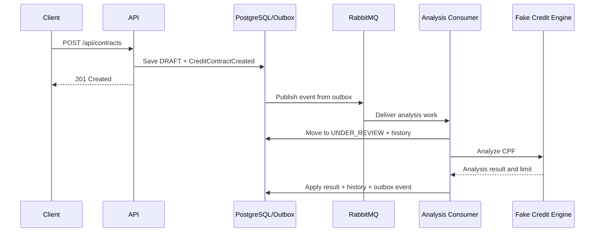

# Implementation Roadmap

This roadmap records the agreed implementation sequence so future tasks can
continue without reconstructing decisions from chat history. Each phase should
be delivered as a separate branch and ready-for-review pull request from an
up-to-date `master`.

The sequence favors working vertical increments over installing infrastructure
without a business flow.

## Current baseline

Already implemented:

- Java 21 and Spring Boot backend;
- CPF-only `DocumentNumber` validation;
- DDD-inspired `CreditContract` aggregate and value objects;
- inbound REST and outbound port/adapter boundaries;
- deterministic credit-limit stub;
- PostgreSQL persistence through an isolated JPA adapter;
- Flyway-managed schema;
- client snapshot stored with the contract;
- generic status-transition history;
- restart-safe contract numbers backed by a PostgreSQL sequence;
- deterministic Brazilian client snapshots derived from the input CPF;
- Docker Compose local environment;
- PostgreSQL integration tests with Testcontainers.

## Phase 1: Generate contract numbers with PostgreSQL ✅

Status: completed.

Suggested branch:

```text
feat/generate-contract-numbers-with-postgres
```

### Goal

Replace the restart-sensitive in-memory `AtomicLong` generator with a
concurrency-safe PostgreSQL sequence while preserving the existing application
port.

### Scope

- Add a Flyway migration for `credit_contract_number_seq`.
- Implement `PostgresContractNumberGenerator` behind
  `ContractNumberGenerator`.
- Format the public identifier as `CT-YYYY-NNNNNN`.
- Keep the unique database constraint on `contract_number`.
- Restrict or remove the runtime stub so Spring has one active implementation.
- Document that sequence gaps are valid after rollbacks or failed requests.
- Add integration coverage proving uniqueness across multiple calls.

### Acceptance criteria

- Application restarts cannot repeat a previously issued number.
- Concurrent generation returns distinct values.
- No `MAX(contract_number) + 1` query is used.
- Unit and PostgreSQL integration tests pass.

## Phase 2: Add a deterministic fake client registry ✅

Status: completed.

Implementation note: Datafaker 2.7.0 was selected instead of a curated local
dataset because its Brazilian locale can generate varied client snapshots while
a CPF-derived seed keeps demonstrations reproducible.

Suggested branch:

```text
refactor/add-deterministic-client-fake
```

### Goal

Return varied, plausible client snapshots during local demonstrations without
introducing flaky or irreproducible behavior.

### Scope

- Rename `StubClientDataProvider` to `FakeClientDataProvider` if it gains
  generation behavior.
- Derive a stable seed from the normalized CPF.
- Generate or select a Brazilian name and valid address from deterministic data.
- Guarantee that the same CPF always returns the same snapshot.
- Keep unit-test fixtures explicit and fixed; do not make unit tests random.
- Evaluate Datafaker versus a small curated local dataset before adding a
  runtime dependency.
- Activate the fake only in an appropriate local profile when a real client
  registry adapter exists.

### Acceptance criteria

- Different CPFs normally produce different snapshots.
- Repeated calls for one CPF produce equal snapshots.
- Generated CEP and address fields satisfy domain validation.
- Tests remain deterministic across machines and runs.

## Phase 3: Add domain events and transactional outbox

Suggested branch:

```text
feat/add-transactional-outbox
```

### Goal

Persist aggregate changes and the intent to publish their events atomically,
without adding a broker dependency yet.

### Scope

- Define a small domain-event abstraction.
- Introduce `CreditContractCreated` as the first event.
- Let the aggregate record new events without knowing their transport format.
- Add an `outbox_events` Flyway migration with fields for:
  - event ID;
  - aggregate ID and type;
  - event type;
  - JSON payload;
  - schema version;
  - occurrence timestamp;
  - correlation and causation IDs;
  - publication state and attempt metadata.
- Persist the contract and outbox records in one transaction.
- Keep serialization and outbox persistence in adapters.
- Add integration tests for atomic success and rollback.

### Acceptance criteria

- A committed contract always has its expected outbox event.
- A failed transaction leaves neither contract nor event committed.
- Domain code has no RabbitMQ, JSON, or JPA dependency.
- Events use stable names and explicit schema versions.

## Phase 4: Publish outbox events through RabbitMQ

Suggested branch:

```text
feat/publish-contract-events-with-rabbitmq
```

### Goal

Reliably relay pending outbox events to RabbitMQ and establish the first durable
messaging topology.

### Scope

- Add RabbitMQ and its management UI to Docker Compose.
- Add Spring AMQP in the outbound messaging adapter.
- Declare a durable contract-events exchange, queues, and bindings.
- Implement an outbox publisher with bounded batches.
- Use publisher confirms before marking an outbox record as published.
- Preserve event ID, type, schema version, correlation ID, and causation ID in
  message metadata.
- Add broker integration tests with Testcontainers.
- Add health information for broker connectivity.

### Acceptance criteria

- Pending events are eventually published after temporary broker downtime.
- Confirmed events are not continuously republished.
- Unconfirmed events remain eligible for retry.
- The topology is declared by the application and reproducible locally.

## Phase 5: Make credit analysis asynchronous

Suggested branch:

```text
feat/process-credit-analysis-asynchronously
```

### Goal

Turn the broker infrastructure into a real business workflow instead of a demo
that only logs messages.

### Decision gate

Before coding, finalize the invariant for contracts awaiting analysis. The
current aggregate requires a credit limit during creation; the asynchronous
model likely needs the limit to be absent until analysis completes. Update the
domain and schema deliberately rather than introducing `null` accidentally.

### Target flow



### Scope

- Add explicit aggregate methods for legal lifecycle transitions.
- Add JPA-to-domain mapping and repository lookup needed by consumers.
- Move credit-limit resolution out of the HTTP creation transaction.
- Consume a contract-created or analysis-requested message.
- Transition through `UNDER_REVIEW` and record history.
- Apply the credit-engine result and publish `CreditAnalysisCompleted`.
- Decide explicitly whether rejection requires a new `REJECTED` status.
- Expose a query endpoint so clients can observe eventual completion.

### Acceptance criteria

- The HTTP request no longer waits for credit analysis.
- Every status change is validated by the aggregate and recorded in history.
- Reprocessing the same event does not repeat the business transition.
- Clients can query the current state after receiving `201 Created`.

## Phase 6: Add messaging resilience and observability

Suggested branch:

```text
feat/harden-event-processing
```

### Goal

Make at-least-once messaging behavior explicit, recoverable, and observable.

### Scope

- Add retry with exponential backoff and a bounded attempt count.
- Configure a dead-letter exchange and queue.
- Add an inbox/processed-message store keyed by event ID.
- Make consumers idempotent within the same transaction as their state change.
- Propagate correlation and causation IDs through logs and events.
- Add structured logs for publication, consumption, retry, and dead-lettering.
- Add Micrometer metrics for pending outbox records, publish latency, consumer
  success/failure, retries, and DLQ depth where available.
- Define an operational replay procedure for dead-lettered messages.
- Test duplicate delivery, consumer failure, broker outage, and recovery.

### Acceptance criteria

- Duplicate messages do not duplicate state changes or history entries.
- Poison messages reach the DLQ after the configured attempts.
- Operators can correlate an HTTP request with its asynchronous processing.
- Metrics and logs explain whether a message is pending, retrying, completed, or
  dead-lettered.

## Follow-up backlog

These items are valuable but should not interrupt the ordered phases above
unless a concrete requirement changes priority:

- explicit block, cancel, activate, and reanalyze use cases;
- read endpoints and pagination;
- optimistic-lock conflict handling;
- GitHub Actions CI with unit and integration tests;
- API authentication and authorization;
- CPF masking, sensitive-data logging rules, and broader LGPD review;
- richer OpenAPI examples and error contracts;
- production secrets and environment-specific configuration;
- tracing and dashboards;
- Kafka evaluation only if replay, retention, or stream-processing requirements
  become real.

## How to use this roadmap

At the beginning of each phase:

1. Verify the live `master` state.
2. Re-read the relevant ADRs.
3. Confirm unresolved decision gates.
4. Create the suggested semantic branch from `master`.
5. Deliver the smallest complete vertical increment.
6. Update this roadmap and ADRs when the implementation changes a decision.
